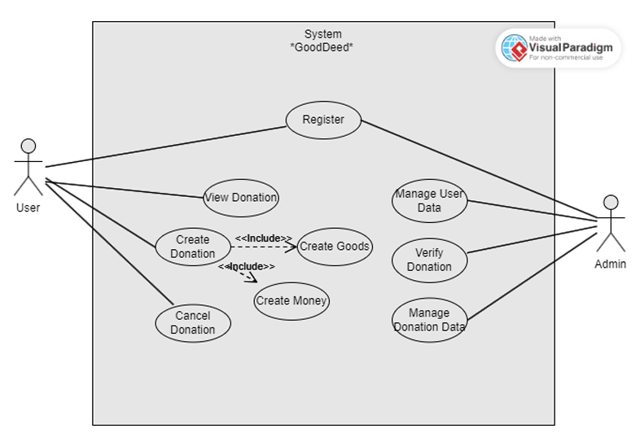
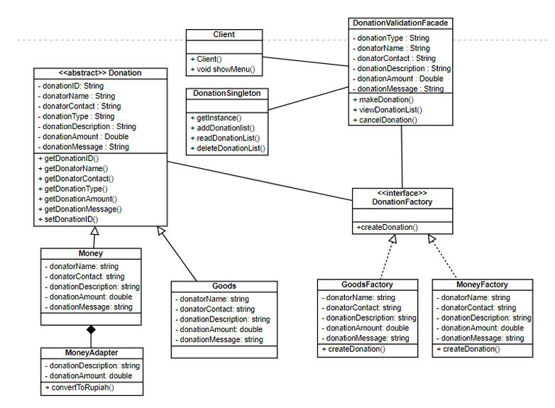

# GoodDeed: Sistem Donasi Uang atau Barang 

## Background
GoodDeed adalah sebuah platform digital inovatif yang dirancang untuk memfasilitasi donasi 
uang dan barang dari para donatur kepada individu atau organisasi yang membutuhkan. Proyek 
ini bertujuan untuk mengatasi masalah transparansi, efisiensi, dan jangkauan dalam proses 
donasi tradisional. 

Metodologi 
Metodologi yang digunakan dalam proyek GoodDeed adalah Object-Oriented Programming 
(OOP). Pendekatan ini dipilih karena kemampuannya dalam memodelkan sistem yang 
kompleks menjadi objek-objek yang saling berinteraksi, sehingga memudahkan 
pengembangan, pengujian, dan pemeliharaan. Aplikasi ini juga menggunakan design pattern 
seperti abstract factory, adapter, singleton, dan facade. Sehingga dapat menghasilkan sistem yang memnuhi prinsip SOLID.

## Use Case

## Class Diagram

Proyek GoodDeed, sistem donasi uang dan barang, memiliki potensi yang signifikan untuk 
merevolusi lanskap filantropi. Dengan mengatasi tantangan transparansi, efisiensi, dan 
jangkauan dalam proses donasi tradisional, GoodDeed bertujuan untuk menciptakan platform 
yang memberdayakan donatur dan penerima manfaat.  

Pendekatan layered architecture yang diadopsi dalam pengembangan GoodDeed memastikan 
skalabilitas, modularitas, dan kemudahan pemeliharaan sistem. Ini memungkinkan tim 
pengembang untuk fokus pada peningkatan dan penambahan fitur secara independen, tanpa 
mengganggu fungsi keseluruhan platform.  

Diharapkan bahwa GoodDeed akan menjadi katalisator dalam mendorong partisipasi 
masyarakat dalam kegiatan donasi. Dengan menyediakan platform yang aman, transparan, dan 
mudah digunakan, GoodDeed dapat menginspirasi lebih banyak individu untuk berbagi 
kebaikan dan memberikan dampak positif bagi mereka yang membutuhkan. 

