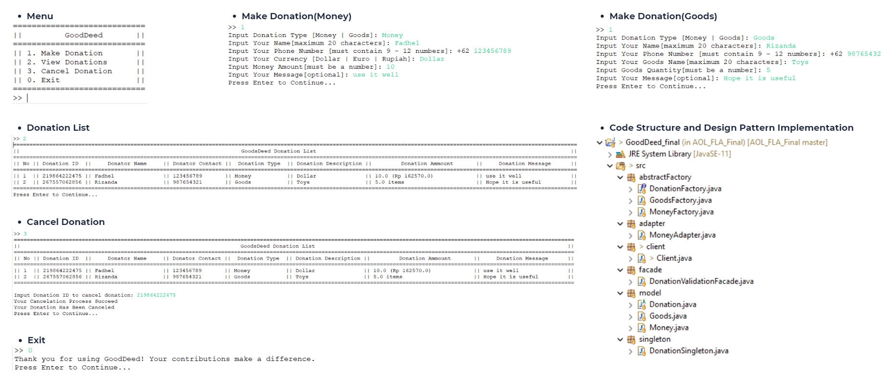

# GoodDeed: Sistem Donasi Uang atau Barang 

## Background
GoodDeed is an innovative digital platform designed to facilitate monetary and goods donations from donors to individuals or organizations in need. This project aims to address issues of transparency, efficiency, and reach in the traditional donation process.

## Methodology
The methodology used in the GoodDeed project is Object-Oriented Programming (OOP). This approach was chosen for its ability to model complex systems into interacting objects, making development, testing, and maintenance easier. The application also incorporates design patterns such as abstract factory, adapter, singleton, and facade, ensuring the system adheres to SOLID principles.

## Use Case

## Class Diagram

## Application

## Conclusion
The GoodDeed project, a donation system for money and goods, holds significant potential to revolutionize the philanthropic landscape. By addressing the challenges of transparency, efficiency, and reach in the traditional donation process, GoodDeed aims to create a platform that empowers both donors and beneficiaries.

The layered architecture approach adopted in the development of GoodDeed ensures scalability, modularity, and ease of maintenance. This allows the development team to focus on enhancing and adding features independently without disrupting the platform's overall functionality.

GoodDeed is expected to serve as a catalyst for increasing community participation in charitable activities. By providing a secure, transparent, and user-friendly platform, GoodDeed can inspire more individuals to share kindness and make a positive impact on those in need.

